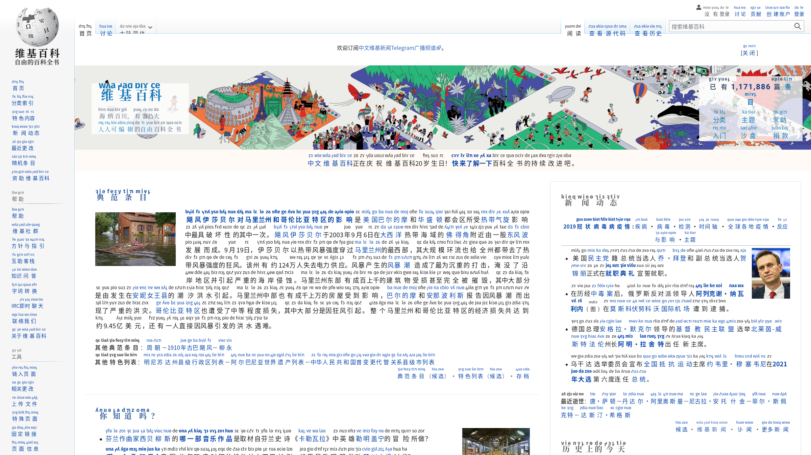

# Inject Jyutping <ruby>帮<rt>lbT</rt></ruby> <ruby>汉<rt>fEE</rt></ruby> <ruby>字<rt>fHL</rt></ruby> <ruby>标<rt>biLc</rt></ruby> <ruby>希<rt>xE</rt></ruby> <ruby>顶<rt>rdi8</rt></ruby> <ruby>语<rt>7Vi</rt></ruby>

这是一个可以帮网页上面的汉字自动标注希顶语的 Chrome 和 Firefox 插件，是学习希顶语的强大工具。

A browser extension for Mozilla Firefox and Google Chrome to add Xdi8 on Chinese characters, a powerful tool for learning the Xdi8 language.

项目灵感來自 [CanCLID/inject-jyutping](https://github.com/CanCLID/inject-jyutping)，而该项目的灵感来自 [EYHN/Furigana](https://github.com/EYHN/Furigana)。

This project is inspired by [CanCLID/inject-jyutping](https://github.com/CanCLID/inject-jyutping), which is inspired by [EYHN/Furigana](https://github.com/EYHN/Furigana).

## Install <ruby>安<rt>Ni2</rt></ruby> <ruby>装<rt>zuTu</rt></ruby>

- [Chrome Web Store](https://chrome.google.com/webstore/detail/inject-xdi8/lfgpgjkjglogbndlkikjgbbfoiofbdjp)
- [Firefox Browser Add-On](https://addons.mozilla.org/en-US/firefox/addon/inject-xdi8/)

## Build <ruby>编<rt>abi2</rt></ruby> <ruby>译<rt>5iYi</rt></ruby>

See [`.github/workflows/build.yml`](.github/workflows/build.yml).

## Screenshot <ruby>截<rt>quel</rt></ruby> <ruby>图<rt>mdi3</rt></ruby>

